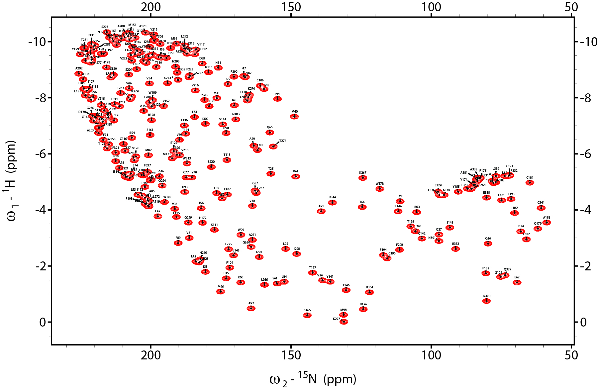

# md2slf

A workflow to predict and simulate [15N-1H] oriented sample solid state NMR spectra from MD trajectories.

<figure>
	
	  <figcaption>A 600 MHz seperated local fied (SLF) spectrum of a GPCR (PDB 3P0G) predicted from 150 ns of molecular dynamics simulation. Linewidths of 100 Hz are used in both dimensions. Results are visualized using NMRFAM-Sparky.</figcaption>
</figure>

## Overview

This repository contains an assortment of scripts to predict a [15N-1H] SLF spectrum from an MD simulation trajectory and convert the output to Sparky format for overlay with experimental spectra. A brief overview of the process:

1. Simulate a membrane protein of interest with any MD simulation package.

2. Load the trajectory into [VMD](https://www.ks.uiuc.edu/Research/vmd/) and use the [slf.tcl](slf.tcl) script to compute time-averaged 15N chemical shifts and 15N-1H dipolar couplings directly from atomic coordinates.

3. Convert the output to a Sparky peak list using the [slf2sparky.py](slf2sparky.py) script. Requires Python 3 (the [Anaconda distribution](http://docs.anaconda.com/anaconda/install/linux/) is recommended).

4. Simulate an 15N-1H SLF spectrum in Sparky format from the peak list file using the [simulate_slf.py](simulate_slf.py) script with desired linewidths and field strength. This requires the [NMRGlue](https://www.nmrglue.com/) library to be installed into Python 3.

The simulated spectrum can then be loaded into [NMRFAM-Sparky](https://nmrfam.wisc.edu/nmrfam-sparky-distribution/) with the corresponding peak list file. Overlays with experimental spectra can be used to aid assignments.

## Quickstart guide

1. Copy the [slf.tcl](slf.tcl) script into the working directory and load simulation trajectory into VMD. For example, in a UNIX terminal, load a CHARMM/NAMD trajectory by:

		vmd simulation.psf simulation.dcd

2. Open console "Extensions -> Tk Console".

3. Select all protein residues. Proline and terminal residues will be automatically filtered out by the script. In the Tk Console type:

		source slf.tcl
		set s [atomselect top "all protein"]
		slf $s -start 2500 -out slf_50-200ns

	This command will utilize each frame from 2500 until the end of the trajectory (10000 in this case). In this example, each frame equates to a timestep of 0.02 ns. The first 50 ns of non-equilibrated trajectory is discarded from the analysis. A file named slf_50-200ns.dat will be created and contains five columns: 1. residue three-letter code, 2. residue number,  3. 15N chemical shift, 4. 15N-1H dipolar couping and 5. N-H order parameter with respect to Z-axis.

	A more advanced example is:

		slf $s -start 2500 -step 2 -stop 7500 -flip 90.0 -ord 0.8 -out slf_50-200ns_unflipped

	This will average from frame 2500 to 7500, skipping every second frame. Values will be tranformed with membrane normal perpendicular to the Z-axis (i.e., an unflipped bicelle). A global order parameter of 0.8 is also applied, which could account for fluctuation in the experimental alignment axis and/or rigid body fluctuation about the helical tilt axis of the protein.
		
4. Convert the output to Sparky peak list format using the [slf2sparky.py](slf2sparky.py) script:

		python slf2sparky.py -i slf_50-200ns.dat -o slf_50-200ns.list -n

	Note that the "-n" flag is used to convert dipolar couplings to negative values, which are more natural to visualize in SPARKY.
	
5. Simulate an SLF spectrum from the peak list file using the [simulate_slf.py](simulate_slf.py) script. This requires the [NMRGlue](https://www.nmrglue.com/) library to be installed.

		python simulate_slf.py \
       		-i slf_50-200ns.dat.list \
       		-o slf_50-200ns.ucsf \
       		--sw_n 20000.0 \
       		--sw_nh 31250.0 \
       		--size_n 2048 \
       		--size_nh 1024 \
       		--lw_n 100.0 \
       		--lw_nh 100.0 \
       		--freq_n 60.7639142 \
       		--carr_n 5600.0

	These are the default settings of the script and don't strictly need to be specified. The above example specifies a 15N spectral width of 20 kHz with 2048 points; a 15N-1H dipolar coupling spectral width of 31.25 kHz with 1024 points; linewidths of 100 Hz in both dimensions; 15N frequency of 60.7639142 MHz (i.e., from a 600 MHz spectrometer) and the carrier offset frequency set at 5600 Hz (92 ppm).

6. Load the spectrum into Sparky:

		sparky slf_50-200ns.ucsf

7. Load the peak list file (slf_50-200ns.list; step 4) into Sparky using the "rp" command.

## Future development
 
 The following features may be added in the future:

* Support for predicting peaks side chain chemical shifts and dipolar couplings.
* Scripts to transform slf.tcl outputs with user-defined vaues of local order parameters (i.e., from relaxation data) and trialing alternative flip angles without having to repeat the entire analysis.
* Prediction of 13C chemical shifts, 13C-1H and 15N-13C dipolar dipolar couplings.
* The option to define specific isotropic chemical shifts and principle axis system components according to residue type and secondary structure. 

## Limitations

While this workflow provides a useful estimate for chemical shifts and dipolar couplings, users should be aware that the accuracy of the approach has several important limitations that should be considered when comparing to experimental data.

#### 15N chemical shift tensor

The slf.tcl script currently uses just one principle axis system for all residues. In OS-ssNMR of proteins, the 15N chemical shift is dominated primarily by the the orientation of the amide plane with respect to the magnetic field. Although, strictly speaking, the isotropic chemical shift also contributes to the oriented shift and varies by several ppm with residue type and secondary structure.

#### Force field parameters
 
The quality of MD force field parameters will heavily influence the accuracy of predicted SLF spectra, especially with respect to backbone bond angles and torsion angles. This has not been assessed in great detail since high-resolution experimental OS-ssNMR data is still scarce.

#### Dynamic residues

Peaks for predicted for dynamic residues (i.e., low order parameter) will be less accurate since MD timescales are often too short to appropriately sample all degrees of freedom. Although, this can be overcome by accelerated MD sampling methods.

#### Use of PDB structures

The slf.tcl script will allow calculation directly from single set of PDB coordinates (provided hydrogens are added), but results will generally be nonsense unless structures have been solved at very high resolution.

#### Rigid body motions

Lipid bilayer rippling and protein rocking motions in MD simulations will introduce slow-timescale fluctuations with respect to the Z-axis and extend the simulation times required to obtain a converged SLF spectral prediction. For single-pass proteins, faster convergence times can be achieved by applying restaints to suppress fluctuation (i.e., the <i>tilt</i> collective variable restrain [implemented in NAMD](https://www.ks.uiuc.edu/Research/namd/2.13/ug/node55.html#SECTION0001241280000000000000)). For larger muti-pass membrane proteins, aligning trajectories to pre-oriented coordinates from the [OPM Database](https://opm.phar.umich.edu/) should be effective. Note, however, that these motions are an actual mode of disorder that dynamically scale experimental chemical shift and dipolar couplings down towards isotropic values. In the case where predicted values appear over estimated, try reducing the "-ord" parameter (default: 1.0) to obtain better agreement to experimental data.

#### Rotational diffusion

This approach assumes that the membrane normal is aligned parallel with the magnetic field (Z-axis) and the all motions in X and Y directions are degenerate. This assumption holds true for <i>flipped</i> bicelles/macrodiscs and glass plates, but only for <i>unflipped</i> bicelles/macrodiscs when the protein undergoes fast axial diffusion. Therefore,  this script is not suited to simulating spectra for <i>unflipped</i> systems undergoing slow axial diffusion.